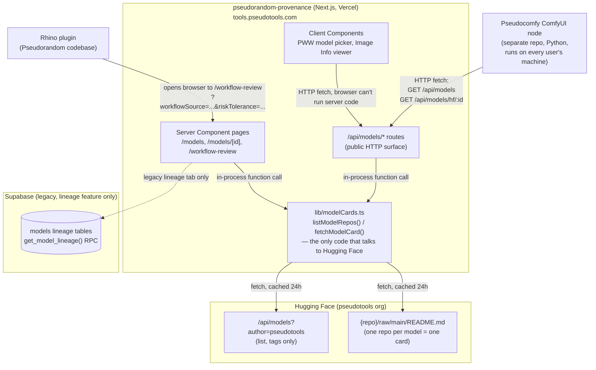

# Web App Architecture

This document explains **pseudorandom-provenance** — the Next.js app deployed at
[tools.pseudotools.com](https://tools.pseudotools.com), source at
[`ednavho/pt-model-database`](https://github.com/ednavho/pt-model-database).
It's written for someone joining the team who needs to maintain this piece of
the system or connect something new to it — the Rhino plugin, the
Pseudocomfy ComfyUI node, or a future integration.

If you only read one section, read [Source of truth](#source-of-truth-hugging-face-card-repos)
and [Why some things call the API and others don't](#why-some-things-call-the-api-and-others-call-the-library-directly) —
almost everything else follows from those two facts.

## The system, end to end



Three things worth internalizing from this diagram before anything else:

1. **Only one piece of code talks to Hugging Face**: `lib/modelCards.ts`. Every page, every API route, and the ComfyUI node all funnel through it — directly (in-process) if they're server-side, or through this app's own `/api/models/*` routes if they're not. Nothing outside this file has ever hit `huggingface.co` directly — see [Why some things call the API and others don't](#why-some-things-call-the-api-and-others-call-the-library-directly).
2. **The Rhino plugin doesn't call this app's API.** It opens a browser tab pointed at `/workflow-review` with a couple of query params. That page is a replacement for a panel that used to render *inside* the plugin — see [Rhino plugin integration](#rhino-plugin-integration).
3. **Supabase still exists**, but only for one feature (lineage graphs), and it's explicitly not the source of truth for anything else anymore. See [The legacy Supabase track](#the-legacy-supabase-track-lineage-only).

## Source of truth: Hugging Face card repos

Model provenance used to live in a Supabase `models` table. It doesn't
anymore. As of the new migration, **every vetted model has its
own repo under the `pseudotools` Hugging Face org** — e.g.
`pseudotools/checkpoint-juggernaut-x-hyper` — and that repo's `README.md` *is*
the model's card: YAML front matter for structured fields, plus a Markdown
body with H2 sections (`## License Findings`, `## Evidence`, `## Rationale`)
for the free-text review writeup.

`lib/modelCards.ts` is the only code that reads this. Two functions:

- **`listModelRepos()`** — one cheap call to Hugging Face's org-listing API
  (`GET https://huggingface.co/api/models?author=pseudotools`). Returns just
  `record_id` + `category` per repo, read from each repo's *tags* — no
  README fetched. This is what powers the Model Database's list view and the
  category filter without needing to fetch all 19+ full cards just to show a
  table.
- **`fetchModelCard(repoPath)`** — the expensive one. Fetches
  `https://huggingface.co/{repoPath}/raw/main/README.md`, parses the YAML
  front matter with `gray-matter`, and returns a full `ModelCardRecord`:
  `record_id`, `category`, `requirement` (the filename ComfyUI expects, e.g.
  `Juggernaut_X_RunDiffusion_Hyper.safetensors`), `display_name`,
  `provenance` (license, attribution, download URL, size, reviewer, the
  three review scores), and `badge` (see below).

Both use `/raw/main/...` — Hugging Face's raw-content endpoint, the same
category of thing as `raw.githubusercontent.com`. Neither of these fetches
the human-facing HTML repo page and scrapes it; both are Hugging Face's own
documented API/CDN routes returning structured data. This distinction came
up explicitly during the migration (there was a review comment worried the
app was "scraping Hugging Face" — it isn't, and never has been).

There's no write path. Editing a model's provenance means editing its
README on Hugging Face directly — `/models/new` and `/submit-model` in this
app are both stub pages that exist only so the old links don't 404;
they explain where to actually do it now.

## Why some things call the API and others call the library directly

This trips people up, so it's worth being explicit. There are two ways
anything in this app gets model data:

| Caller | How | Why |
|---|---|---|
| Server Component pages (`app/models/page.tsx`, `app/models/[...id]/page.tsx`, `app/workflow-review/page.tsx`) | Import and call `listModelRepos()` / `fetchModelCard()` directly | These render **on the server**. There's no reason to make an HTTP round-trip to your own app's API when you can just call the function — it's the same process. |
| Client Components (`WorkflowWizard.tsx` in the Package Workflow Wizard, `ImageInfoViewer.tsx`) | `fetch('/api/models/hf/...')` over HTTP | These run **in the browser** (`'use client'`). They cannot import `lib/modelCards.ts` and call it directly — that code runs server-side only. Going through the API route is the only option. |
| Pseudocomfy ComfyUI node (separate repo, Python) | `fetch('https://tools.pseudotools.com/api/models')` / `.../api/models/hf/:id` | Runs on end users' machines, completely outside this app's process. HTTP is the only way in. |
| Rhino plugin | Doesn't call the API at all — opens `/workflow-review?workflowSource=...` in a browser | Different integration shape entirely — see [Rhino plugin integration](#rhino-plugin-integration). |

So the `/api/models/*` routes exist specifically for consumers that
*can't* be in-process with this app — a separate Python process on someone's
machine, or JavaScript running in a browser tab. If you're adding a new
Server Component page, you almost certainly want to call
`lib/modelCards.ts` directly, not fetch your own API.

## API surface reference

All routes live under `app/api/models/`.

| Route | Backed by | Called by |
|---|---|---|
| `GET /api/models` | `listModelRepos()` (Hugging Face) | Pseudocomfy ComfyUI node. Optional `?category=` filter. Deliberately doesn't fetch full cards — stays cheap. |
| `GET /api/models/hf/:repoPath` | `fetchModelCard()` (Hugging Face) | Pseudocomfy node, `WorkflowWizard.tsx`, `ImageInfoViewer.tsx`. `:repoPath` is a catch-all route segment (`[...id]`) because a repo path contains a slash. |
| `GET /api/models/hf/by-filename/:filename` | `listModelRepos()` + `fetchModelCard()` (Hugging Face) | `WorkflowWizard.tsx`, as a fallback when a ComfyUI loader node has a filename but no `model_id` pointer. |
| `GET/PATCH/DELETE /api/models/:id` | Supabase `models` table | **No known caller in this repo.** Pre-migration leftover — reads/writes the old schema, which nothing populates anymore. Not deleted yet; flagged as a cleanup candidate, not confirmed dead system-wide (the Rhino plugin's own code wasn't checked). |
| `GET /api/models/:id/lineage` | Supabase `get_model_lineage()` RPC | Same caveat as above — no caller found in this repo. |
| `GET /api/models/by-filename/:filename` | Supabase `models` table | Same caveat — superseded by the `/hf/by-filename/` route above, which *is* actually called. |

If you're auditing this list later and confirm the three Supabase-backed
routes really are unused, they're safe to delete along with
`utils/supabase/server.ts`'s usage in them — just double check the Rhino
plugin doesn't hit them first.

## The -1..3 Assessment Badge

Every model and every workflow gets a badge from **-1 to 3**, computed from
three review dimensions that live in a card's `provenance`:
`risk_severity`, `evidence_completeness`, `evidence_reliability` (each a
0-4 scale, or `-1` for "not yet scored"). This replaced an older five-value
`ReviewStatus` system (`vetted` / `likely_safe` / `needs_review` /
`potentially_problematic` / `unknown`) that used to be computed separately
and inconsistently in a few different places — the badge system is the
single formula now, exported from `lib/modelCards.ts` and used everywhere:
the Model Database table, the model detail page, the PWW model picker, the
Image Info viewer, and independently re-implemented in the Rhino plugin
itself for its own icon (see below).

**Requirement-level badge** (`computeRequirementBadge`) — numbers only here;
see [the two label sets](#two-label-sets-same-numbers-different-surfaces)
below for what each number actually renders as, since that differs by
surface and neither matches the internal names this formula was originally
specced with:

```
certainty = min(evidence_completeness, evidence_reliability)

risk_severity == -1 or certainty == -1   →  -1
certainty <= 1                            →   0
risk_severity >= 3                        →   1
risk_severity <= 1                        →   3
else (risk_severity == 2)                 →   2
```

The reasoning: certainty gates whether the risk score is even trustworthy
enough to report. A severe-sounding risk score backed by weak evidence
reads as "we don't actually know," not "confirmed dangerous."

**Workflow-level badge** (`computeWorkflowBadge`) collapses every
requirement's three scores into one triple before running the same formula,
using an aggregation picked by `riskTolerance` (`high` / `low` / `dev`):

- `high` — average each dimension across requirements
- `low` — worst case: min(completeness), min(reliability), max(severity)
- `dev` — no badge at all; the workflow always runs regardless of score

`riskTolerance` is a setting the Rhino plugin is expected to pass in as a
query param — see the next section.

### Two label sets, same numbers, different surfaces

- Icon-only (a badge shown with no visible text, just an icon + tooltip —
  used by the Rhino plugin's own icon and this app's workflow-review title
  badge): *"We haven't checked yet"* / *"We looked, but can't tell"* /
  *"We have significant concerns"* / *"We have some concerns"* / *"Looks
  good, have fun!"*
- Visible tag (an actual pill with text — used everywhere a model or
  requirement gets its own row/card): *"Review Pending"* / *"Insufficient
  information"* / *"Not recommended"* / *"Potentially problematic"* /
  *"Healthy"*

## Rhino plugin integration

The plugin used to have an in-plugin "Workflow Details" panel. That's gone —
replaced by `/workflow-review`, a page this app renders that the plugin
opens in the user's default browser via a button next to the workflow name.

**Contract**, read from `app/workflow-review/page.tsx`'s own header comment:

- `workflowSource` (required) — a URL pointing at the *entire* pseudorandom
  workflow document (the same JSON `WorkflowWizard.tsx`'s `buildOutput()`
  produces, and what the Package Workflow Wizard downloads as
  `<name>.pseudorandom.json`). The page fetches this URL itself.
- `riskTolerance` (optional) — `high` / `low` / `dev`, feeds the workflow
  badge formula above. Falls back to `low` (the most conservative option)
  if missing or invalid — deliberately not `high`, since there's no spec
  for what an absent value should mean and this errs toward surfacing
  concerns rather than hiding them.

**How the plugin actually generates and hosts that `workflowSource` URL is
not something this app controls or has visibility into** — that's plugin
side. If you're debugging a broken `/workflow-review` link, start there,
not here.

The plugin also renders its own badge icon using the same -1..3 formula,
independently implemented in whatever language the plugin is written in.
**There is no shared code between the two implementations** — they're kept
in sync by the two of them agreeing on the spec above, not by importing a
shared library. If the formula ever changes, both sides need to change
together by hand.

## Pseudocomfy (ComfyUI node) integration

Separate repo, separate language (Python), installed on every end user's
own ComfyUI instance — this is the "Vetted Loader" nodes (checkpoint,
ControlNet, LoRA, CLIP) that populate their dropdowns from the vetted model
catalog.

**This migrated twice:**

1. Originally: called a Supabase REST endpoint directly, using a public
   anon key baked into the node's source.
2. Then: migrated to Hugging Face, but called `huggingface.co` **directly**
   from every installed copy of the node — thousands of separate machines
   each hitting Hugging Face's API independently, with no way for this team
   to control, cache, or instantly change what "vetted" means without
   shipping a new node version to every user.
3. **Now**: calls this app's own `/api/models` and `/api/models/hf/:id`
   instead. Same data, but proxied through one server this team owns —
   which is also why the [24h cache](#caching) below now speeds up every
   ComfyUI install for free, something that wasn't possible when the node
   talked to Hugging Face directly.

The lesson generalizes: **any new external consumer of this data should go
through `/api/models/*`, never straight to Hugging Face.** That's the whole
point of this app existing as a layer instead of everyone just calling
Hugging Face's API themselves.

## Caching

Every `fetch()` in `lib/modelCards.ts` is tagged
`next: { revalidate: 60 * 60 * 24 }` (24 hours). This is Next.js's built-in
fetch cache, not a custom cache — on Vercel it's backed by their platform's
Data Cache, which (unlike the newer `"use cache"` directive's default
in-memory behavior) actually persists across separate serverless function
invocations. Confirmed empirically on the real deployment: first request
after the cache is cold, ~1.6s (the real ~20 outbound Hugging Face calls
this app makes — 1 list + 1 README per model); every request after that for
the next 24h, ~0.2-0.3s, served straight from cache with zero outbound
calls.

**Scope: shared across everyone, not per-user.** The cache lives on the
server, keyed by the outbound Hugging Face URL — not by who's asking. First
visitor of the day (or first request after a fresh deploy) pays the real
fetch cost and populates the cache for literally everyone else hitting the
same deployment afterward, whether that's a different person, a different
machine, or the ComfyUI node.

**Tradeoffs, accepted deliberately, not oversights:**

- **Rolling 24h, not a midnight reset.** A page loaded at 11pm stays cached
  until 11pm the next day, not until midnight. Simpler to implement, no
  meaningfully different UX for this use case.
- **Up to 24h of staleness.** If someone edits a model's README on Hugging
  Face, that edit won't show up here until the cache entry for that repo
  ages out. There's no manual bypass/revalidate button built — if that
  becomes a real pain point, `revalidateTag`/`revalidatePath` are the tool
  to reach for, but nothing like that exists today.
- **Per-deployment, not per-domain.** A local dev server and the production
  deployment have entirely separate caches. Preview deployments (from
  `vercel deploy` without `--prod`) also get their own separate cache from
  production.

## The legacy Supabase track (lineage only)

Supabase is not dead in this app — it's scoped down to exactly one feature:
**model lineage** (what a checkpoint was trained on, what dataset a LoRA
derives from, etc.), rendered as a graph in the Image Info viewer's lineage
tab.

Two different data sources feed that graph, and it's worth knowing which is
which:

- **`data/lineageData.ts`** — a hand-curated, static TypeScript file. Not
  fetched from anywhere, not a database. Its own header comment is explicit
  about this: *"Desk research, not a database... the shape is deliberately
  loose so the interaction can tell us what the real tables need."* Nodes
  are flagged `verified: true` (checked against a real source — an arXiv
  paper, a Hugging Face card) or `verified: false` (a plausible guess,
  mainly for community LoRAs that rarely document their own training data).
- **`app/lineage-sketch/`** — an explicitly-labeled throwaway design
  prototype ("A throwaway sketch of what model lineage could look like as a
  graph... the point is to find out what the interaction needs before
  deciding what the tables should hold"). Don't mistake this for a real
  feature — it's UX exploration using the same static fake data above.
- **`types/database.ts`**'s `VettingStatus` (`vetted` /
  `potentially_problematic` / `unknown`) is the one piece of the *old*
  pre-Hugging-Face schema still load-bearing — but only for rendering the
  lineage tab on **pre-migration images** (PNGs rendered before the
  Hugging Face migration shipped, which embedded their own
  `vetting_status` directly in the image's metadata rather than a
  `risk_severity`/`evidence_completeness`/`evidence_reliability` triple).
  New images use the -1..3 badge system instead;
  `components/ui/VettingBadge.tsx` and `components/ui/RiskBadge.tsx` are
  deliberately two separate components for exactly this reason — they
  render two different, non-overlapping data shapes.

`GET /api/models/:id`, `GET /api/models/:id/lineage`, and
`GET /api/models/by-filename/:filename` are Supabase-backed routes that
exist in the codebase but, as far as this repo's own frontend code goes,
have no caller left — see the [API reference table](#api-surface-reference)
above.

## Deployment

- **Vercel project**: `pseudorandom-provenance`, under the
  `pseudotools-admins-projects` team.
- **Domain**: `tools.pseudotools.com` (DNS/CNAME managed outside this repo).
- **Git integration**: connected to `ednavho/pt-model-database` on GitHub —
  pushes to `main` auto-deploy to production; other branches get Preview
  deployments automatically.
- **Env vars** (Production/Preview/Development):
  `NEXT_PUBLIC_SUPABASE_URL`, `NEXT_PUBLIC_SUPABASE_ANON_KEY` (both
  intentionally public — access is governed by Supabase Row Level Security,
  not by keeping the key secret), and `NEXT_PUBLIC_SITE_URL` (Production
  only, currently unused anywhere in the codebase).
- **Note on repo ownership**: `pt-model-database` currently lives under a
  personal GitHub account, not the Pseudotools org. There's an open,
  unresolved thread about transferring it into the org — worth checking
  the current state of that before assuming otherwise.

## Quick pointers for common tasks

- **Adding a new field to a model card** → add it to `ModelProvenance` in
  `lib/modelCards.ts`, update the card template on the Hugging Face side,
  and it'll flow through `fetchModelCard()` to every consumer automatically.
- **Adding a new page that needs model data, rendered server-side** → import
  `lib/modelCards.ts` directly. Don't fetch your own API.
- **Adding a new external consumer** (another tool, another plugin) → point
  it at `/api/models` and `/api/models/hf/:id`, the same way Pseudocomfy
  does. Never point a new consumer at Hugging Face directly — see
  [Pseudocomfy integration](#pseudocomfy-comfyui-node-integration) for why
  that's a trap.
- **Something looks stale** → check the [caching](#caching) section before
  assuming something's broken. Up to 24h of staleness is expected behavior,
  not a bug.
- **The badge formula needs to change** → it has to change in *two* places
  by hand: `lib/modelCards.ts` here, and the Rhino plugin's own
  implementation. There is no shared code to update once.
